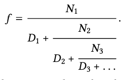
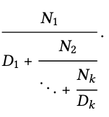

# CS61A - Week 3 Homework

## Question 1

**SICP Exercise 1.1.16** - Design a procedure that evolves an iterative exponentiation process that uses successive squaring and uses a logarithmic number of steps, as does `fast-expt`.

> See `iter-expt.scm`
>
> ```scheme
> (require berkeley)
>
> (define (even? n)
>  (= (remainder n 2) 0))
>
> (define (fast-expt b n)
>  (cond ((= n 0) 1)
>        ((even? n) (square (fast-expt b (/ n 2))))
>        (else (* b (fast-expt b (- n 1)))) ))
>
> (define (iter-fast-expt b n)
>  (define (iter invariant b n)
>    (cond ((= n 0) invariant)
>          ((even? n) (iter invariant (square b) (/ n 2)))
>          (else (iter (* invariant b) b (- n 1))))
>    )
>  (iter 1 b n))
> ```

**SICP Exercise 1.35** - Show that the golden ratio phi (section 1.2.2) is a fixed point of the transformation `x => 1 + 1/x`, and use this fact to compute phi by means of the `fixed-point` procedure.

> ```math
> f(phi) = phi
> f(x) = 1 + 1/x
> x = 1 + 1/x          (At the fixed point where x = phi)
> x^2 = x(1 + 1/x)     (Multiply both sides by x)
> x^2 = x + 1          (Multiple out brackets)
> x = phi              (Per definition of golden ratio)
> ```
>
> See `golden-ratio.scm`
>
> ```scheme
> (define (fixed-point f first-guess)
>  (define tolerance 0.00001)
>  (define (close-enough? v1 v2)
>    (< (abs (- v1 v2))
>       tolerance))
>  (define (try guess)
>    (let ((next (f guess)))
>      (if (close-enough? guess next)
>          next
>          (try next))))
>  (try first-guess))
>
> (define (golden-ratio)
>  (fixed-point (lambda (x) (+ 1 (/ 1 x))) 1.0))
> ```

**SICP Exercise 1.37** - An infinite continued fraction is an expression of the form



As an example, one can show that the infinite continued fraction expansion with the Ni and the Di all equal to 1 produces 1/φ, where φ is the golden ratio (described in Section 1.2.2). One way to approximate an infinite continued fraction is to truncate the expansion afer a given number of terms. Such a truncation — a so-called _k-term finite continued fraction_ — has the form



Suppose that n and d are procedures of one argument (the term index i) that return the Ni and Di of the terms of the continued fraction. Define a procedure cont-frac such that evaluating (cont-frac n d k) computes the value of the k-term finite continued fraction. Check your procedure by approximating 1/φ using

```scheme
(cont-frac (lambda (i) 1.0)
           (lambda (i) 1.0)
           k)
```

for successive values of k. How large must you make k in order to get an approximation that is accurate to 4 decimal places?

> See `cont-frac.scm`
>
> ```scheme
> (define (cont-frac n d k)
>   (define (iter i n d k)
>     (if (equal? i k)
>       (/ (n k) (d k))
>       (/ (n i) (+ (d i) (iter (+ i 1) n d k))) ))
>   (iter 0 n d k))
> ```
>
> This solution uses a _recursive process_ because the base case doesn't contain the answer. The computer has to store every step of the process until it hits the base case, only then working back. This gives it an arrow-shaped (>) trace and linear time and space complexity.
>
> `cont-fract` for values of `k > 10` return approximations accurate to 4 decimal places (`0.6180...`).

b. If your cont-frac procedure generates a recursive process, write one that generates an iterative process. If it generates an iterative process, write one that generates a recursive process.

> See `cont-frac.scm`
>
> ```scheme
> ; My attempt (doesn't work)
> (define (cont-frac-iter n d k)
>  (define (iter i n d k result)
>    (if (equal? i k)
>        result
>        (iter (+ i 1)
>              n d k (/ result (d i)))))
>
>  (iter 0 n d k (n 0)))
>
> ; The model answer
> (define (cont-frac-iter2 n d k)
>  (define (iter k result)
>    (if (= k 0)
>        result
>        (iter (- k 1)
>              (/ (n k) (+ (d k) result))) ))
>  (iter k 0))
> ```
>
> I struggled with the mathematics on this one. The key difference between the approach I took and the model answers is that the model answer starts at the finite fraction `N(k)/D(k)` and iterates values of `k` _downwards_ towards 0. The model answer starts with the base case and works backwards until the predicate is `true`.

**SICP Exercise 1.38** - In 1737, the Swiss mathematician Leonhard Euler published a memoir _De Fractionibus Continuis_, which included a continued fraction expansion for `e − 2`, where `e` is the base of the natural logarithms. In this fraction, the `Ni` are all 1, and the `Di` are successively `1, 2, 1, 1, 4, 1, 1, 6, 1, 1, 8, ...`. Write a program that uses your `cont-frac` procedure from Exercise 1.37 to approximate `e`, based on Euler’s expansion.

> See `euler-cont-frac.scm`
>
> ```scheme
> (define (approx-e k)
>  (define (n i) 1.0)
>
>  (define (d i)
>    (if (equal? (remainder i 3) 2)
>        (* 2 (+ 1 (quotient (- i 2) 3)))
>        1))
>
>  (+ (cont-frac n d k) 2))
> ```

## Question 2

A "perfect number" is defined as a number equal to the sum of all its factors less than itself. For example, the first perfect numer is 6, because its factors are 1, 2, 3 and 6, and 1 + 2 + 3 = 6. The second perfect number is 28, because 1 + 2 + 4 + 7 + 14 = 28. What is the third perfect number? Write a procedure (`next-perf n`) that tests numbers starting with `n` and continuing with `n+1`, `n+2` etc. until a perfect number is found. Then you can evaluate (`next-perf 29`) to solve the problem. Hint: you'll need a `sum-of-factors` subprocedure.

[Note: If you run this program when the system is heavily loaded, it may take half an hours to compute the answer! Try tracing helper procedures to make sure your program is on track, or start by computing (`next-perf 1`) and see if you get 6.]

> See next-perf.scm
>
> ```scheme
> ; Iterative process with recursive syntax
> (define (sum-of-factors n)
>  (define (is-factor? a b) (equal? (remainder b a) 0))
>
>  (define (accumulator i sum)
>    (if (equal? i 0)
>        sum
>        (accumulator (- i 1) (+ sum (if (is-factor? i n)
>                                   i
>                                   0)))))
>
>  (accumulator (quotient n 2) 0))
>
> ; Recursive process
> (define (next-perf n)
>  (define (is-perf? n) (equal? (sum-of-factors n) n))
>
>  (if (is-perf? (+ n 1))
>      (+ n 1)
>      (next-perf (+ n 1))))
> ```

## Question 3

Explain the effect of interchanging the order in which the base cases in the `cc` procedure on page 41 of Abelson and Sussman are checked. That is, describe completely the set of arguments for which the original `cc` procedure would return a different value or behave differently from a `cc` procedure coded as given below, and explain how the returned values would differ.

```scheme
(define (cc amount kinds-of-coins)
    (cond
        ((or (< amount 0) (= kinds-of-coins 0)) 0)
        ((= amount 0) 1)
        (else ...) ) )      ; as in the original version
```

> Where `amount` equals 0 and `kinds-of-coins` equals 0, the above `cc` procedure would return 0, whereas the original `cc` procedure would return 1.

## Question 4

Give an algebraic formula relating the values of the parameter `b`, `n`, `counter`, and `product` of the `expt` and `exp-iter` procedures given near the top of page 45 of Abelson and Sussman. (The kind of answer we're loking for is "the sum of b, n, and counter times product is always equal to 37.")

> I didn't get this. Maths. From the answers:
>
> The product of PRODUCT times [B to the COUNTER power] is always equal to [B to the N power].
