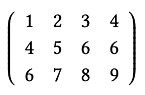
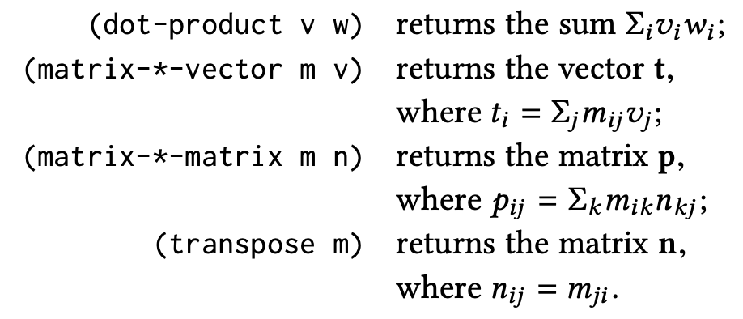

# CS61A - Week 5 Homework

## SICP exercises

**SICP Exercise 2.24** - Suppose we evaluate the expression `(list 1 (list 2 (list 3 4)))`. Give the result printed by the interpreter, the corresponding box-and-pointer structure, and the interpretation of this as a tree (as in Figure 2.6).

> Result from interpreter: `'(1 (2 (3 4)))`
>
> > 

**SICP Exercise 2.26** - Suppose we define `x` and `y` to be two lists:

```scheme
(define x (list 1 2 3))
(define y (list 4 5 6))
```

What result is printed by the interpreter in response to evaluating each of the following expressions:

```scheme
(append x y)
(cons x y)
(list x y)
```

> `(append x y)` => `'(1 2 3 4 5 6)`
>
> `(cons x y)` => `'((1 2 3) 4 5 6)`
>
> `(list x y)` => `'((1 2 3) (4 5 6))`

**SICP Exercise 2.29** - A binary mobile consists of two branches, a left branch and a right branch. Each branch is a rod of a certain length, from which hangs either a weight or another binary mobile. We can represent a binary mobile using compound data by constructing it from two branches (for example, using `list`):

```scheme
(define (make-mobile left right)
  (list left right))
```

A branch is constructed from a `length` (which must be a number) together with a `structure`, which may be either a number (representing a simple weight) or another mobile:

```scheme
(define (make-branch length structure)
  (list length structure))
```

a. Write the corresponding selectors `left-branch` and `right-branch`, which return the branches of a mobile, and `branch-length` and `branch-structure`, which return the components of a branch.

> See `mobile.scm`:
>
> ```scheme
> ; Selectors
> (define (left-branch mobile) (car mobile))
> (define (right-branch mobile) (cdr mobile))
> (define (branch-length branch) (car branch))
> (define (branch-structure branch) (cdr branch))
> ```

b. Using your selectors, define a procedure `total-weight` that returns the total weight of a mobile.

> See `mobile.scm`:
>
> ```scheme
> (define (branch-weight branch)
>  (if (number? (branch-structure branch))
>      (branch-structure branch)
>      (total-weight (branch-structure branch))))
>
> (define (total-weight mobile)
>  (+ (branch-weight (left-branch mobile))
>     (branch-weight (right-branch mobile))))
> ```

c. A mobile is said to be balanced if the torque applied by its top-left branch is equal to that applied by its top-right branch (that is, if the length of the left rod multiplied by the weight hanging from that rod is equal to the corresponding product for the right side) and if each of the submobiles hanging off its branches is balanced. Design a predicate that tests whether a binary mobile is balanced.

> See `mobile.scm`:
>
> ```scheme
> (define (balanced-branch? branch)
>  (if (number? (branch-structure branch))
>      #t
>      (balanced? (branch-structure branch))))
>
> (define (balanced? mobile)
>  (and (equal? (branch-torque (left-branch mobile)) (branch-torque >(right-branch mobile)))
>       (balanced-branch? (left-branch mobile))
>       (balanced-branch? (right-branch mobile))))
> ```

d. Suppose we change the representation of mobiles so that the constructors are

```scheme
(define (make-mobile left right) (cons left right))
(define (make-branch length structure)
  (cons length structure))
```

How much do you need to change your programs to convert to the new representation?

> You only need to change the selectors `right-branch` and `branch-structure` by replacing invocations of `cadr` with `cdr`. The underlying data structure is changing from a list to a pair, so `cdr` selects the second element of the pair in the same way that `cadr` selects the second element of the list. The rest of the procedures work exactly the same because they respect the abstraction barrier.

**SICP Exercise 2.30** - Define a procedure `square-tree` analogous
to the `square-list` procedure of Exercise 2.21. That is, `square-tree` should behave as follows:

```scheme
(square-tree
    (list 1
        (list 2 (list 3 4) 5)
        (list 6 7)))
> (1 (4 (9 16) 25) (36 49))
```

Define `square-tree` both directly (i.e., without using any higher-order procedures) and also by using map and recursion.

> See `square-tree.scm`
>
> ```scheme
> ; Using map
> (define (square-tree-map tree)
>  (if (number? tree)
>      (* tree tree)
>      (map square-tree-map tree)))
>
> ; Without higher-order-functions
> (define (square-tree tree)
>  (cond ((null? tree) '())
>        ((number? tree) (square tree))
>        (else (cons (square-tree (car tree))
>                    (square-tree (cdr tree))))))
> ```

**SICP Exercise 2.31** - Abstract your answer to Exercise 2.30 to produce a procedure `tree-map` with the property that `square-tree` could be defined as

```scheme
(define (square-tree tree) (tree-map square tree))
```

> See `tree-map.scm`
>
> ```scheme
> (define (tree-map fn tree)
>  (if (number? tree)
>      (fn tree)
>      (map (lambda (t) (tree-map fn t)) tree)))
> ```

**SICP Exercise 2.32** - We can represent a set as a list of distinct elements, and we can represent the set of all subsets of the set as a list of lists.

For example, if the set is `(1 2 3)`, then the set of all subsets is
`(() (3) (2) (2 3) (1) (1 3) (1 2) (1 2 3))`.

Complete the following definition of a procedure that generates the set of subsets of a set and give a clear explanation of why it works:

```scheme
(define (subsets s)
  (if (null? s)
      (list nil)
      (let ((rest (subsets (cdr s))))
        (append rest (map ⟨??⟩ rest)))))
```

❌ I didn't get this. Answers from the [CS61A homework solutions pdf](https://people.eecs.berkeley.edu/~bh/61a-pages/Solutions/week6).

> See `subsets.scm`
>
> ```scheme
> (define (subsets s)
>  (if (null? s)
>      (list nil)
>      (let ((rest (subsets (cdr s))))
>        (append rest (map (lambda (set) (cons (car s) set)) rest)))))
> ```
>
> Explanation: The subsets of a set can be divided into two categories:
> those that include the first element and those that don't. Each of the
> former (including the first element) consists of one of the latter
> (without the first element) with the first element added. For example,
> the subsets of (1 2 3) are
>
> not including 1: () (2) (3) (2 3)
> including 1: (1) (1 2) (1 3) (1 2 3)
>
> But the "not including 1" ones are exactly the subsets of (2 3),
> which is the cdr of the original set. So the LET uses a recursive
> call to find those subsets, and we append to them the result of
> sticking 1 (the car of the original set) in front of each.
>
> Note: It's really important to put the recursive call in a LET
> argument rather than use two recursive calls, as in
>
> ```scheme
> (append (subsets (cdr s))
>         (map (lambda (set) (cons (car s) set))
>              (subsets (cdr s))))
> ```
>
> because that would take Theta(3^n) time, whereas the original version
> takes Theta(2^n) time. Both are slow, but that's a big difference.

**SICP Exercise 2.36** - The procedure `accumulate-n` is similar to `accumulate` except that it takes as its third argument a sequence of sequences, which are all assumed to have the same number of elements.

It applies the designated accumulation procedure to combine all the first elements of the sequences, all the second elements of the sequences, and so on, and returns a sequence of the results.

For instance, if `s` is a sequence containing four sequences, `((1 2 3) (4 5 6) (7 8 9) (10 11 12))`, then the value of `(accumulate-n + 0 s)` should be the sequence `(22 26 30)`.

Fill in the missing expressions in the following definition of accumulate-n:

```scheme
(define (accumulate-n op init seqs)
  (if (null? (car seqs))
      nil
      (cons (accumulate op init ⟨??⟩)
            (accumulate-n op init ⟨??⟩))))
```

> See `accumulate-n.scm`:
>
> ```scheme
> (define (accumulate-n op init seqs)
>  (if (null? (car seqs))
>      nil
>      (cons (accumulate op init (map car seqs))
>            (accumulate-n op init (map cdr seqs)))))
> ```

**SICP Exercise 2.37** - Suppose we represent vectors `v = (vi)` as sequences of numbers, and matrices `m = (mij)` as sequences of vectors (the rows of the matrix).

For example, the matrix

is represented as the sequence `((1 2 3 4) (4 5 6 6) (6 7 8 9))`.

With this representation, we can use sequence operations to concisely express the basic matrix and vector operations. These operations (which are described in any book on matrix algebra) are the following:



We can define the dot product as:

```scheme
(define (dot-product v w)
  (accumulate + 0 (map * v w)))
```

(This definition uses the extended version of map described in Footnote 12.)

Fill in the missing expressions in the following procedures for computing the other matrix operations. (The procedure `accumulate-n` is defined in Exercise 2.36.)

```scheme
(define (matrix-*-vector m v)
  (map ⟨??⟩ m))

(define (transpose mat)
  (accumulate-n ⟨??⟩ ⟨??⟩ mat))

(define (matrix-*-matrix m n)
  (let ((cols (transpose n)))
    (map ⟨??⟩ m)))
```

> See `matrices_and_vectors.scm`.
>
> ```scheme
> (define (dot-product v w)
>  (accumulate + 0 (map * v w)))
>
> (define (matrix-*-vector m v)
>  (map (lambda (matrix-row) (dot-product v matrix-row)) m))
>
> (define (transpose mat)
>  (accumulate-n cons '() mat))
>
> (define (matrix-*-matrix m n)
>  (let ((cols (transpose n)))
>    (map (lambda (row) (matrix-*-vector cols row)) m)))
> ```

**SICP Exercise 2.38** - The `accumulate` procedure is also known as `fold-right`, because it combines the first element of the sequence with the result of combining all the elements to the right. There is also a `fold-left`, which is similar to `fold-right`, except that it combines elements working in the opposite direction:

```scheme
(define (fold-left op initial sequence)
  (define (iter result rest)
    (if (null? rest) result
        (iter (op result (car rest))
              (cdr rest))))
  (iter initial sequence))
```

```scheme

```

What are the values of

```scheme
(fold-right / 1 (list 1 2 3))
(fold-left / 1 (list 1 2 3))
(fold-right list nil (list 1 2 3))
(fold-left list nil (list 1 2 3))
```

> `(fold-right / 1 (list 1 2 3))` => `1 1/2`
>
> `(fold-left / 1 (list 1 2 3))` => `1 1/2`
>
> `(fold-right list nil (list 1 2 3))` => `'(1 (2 (3 ())))`
>
> `(fold-left list nil (list 1 2 3))` => `'(3 (2 (1 ())))`

Give a property that `op` should satisfy to guarantee that `fold-right` and `fold-left` will produce the same values for any sequence.

> `op` should be associative, i.e. the same result is returned whatever the order in which `op` is performed on values.

**Exercise 2.54** Two lists are said to be `equal?` if they con- tain equal elements arranged in the same order. For example,

```scheme
(equal? '(this is a list) '(this is a list))
```

is true, but

```scheme
(equal? '(this is a list) '(this (is a) list))
```

is false. To be more precise, we can define `equal?` recursively in terms of the basic `eq?` equality of symbols by saying that `a` and `b` are `equal?` if they are both symbols and the symbols are `eq?`, or if they are both `lists` such that `(car a)` is `equal?` to `(car b)` and `(cdr a)` is `equal?` to `(cdr b)`.

Using this idea, implement `equal?` as a procedure.

```scheme
(define (equal? a b)
  (cond ((and (symbol? a) (symbol? b)) (eq? a b))
        ((or (symbol? a) (symbol? b)) #f)
        ((and (number? a) (number? b)) (= a b))
        ((or (number? a) (number? b)) #f)
        ((and (null? a) (null? b)) #t)
        ((or (null? a) (null? b)) #f)
        ((equal? (car a) (car b)) (equal? (cdr a) (cdr b)))
        (else #f)))
```

## CS61A homework question

Extend the calculator program from lecture to include words as data, providing the operations `first`, `butfirst`, `last`, `butlast`, and `word`.

Unlike Scheme, your calculator should treat words as self-evaluating expressions except when seen as the operator of a compound expression. That is, it should work like these examples:

```scheme
calc: foo
foo
calc: (first foo)
f
calc: (first (butfirst hello))
e
```

> See `z-calc.scm`
>
> ```scheme
> ; add this line to the calc-eval cond expression:
>        ((word? exp) exp)
>
> ; and add these lines to the calc-apply cond expression:
>        ((eq? fn 'first) (cond ((null? args) (error "Calc: no args to first"))
>                               ((= (length args) 1) (first (first args)))
>                               (else (first args))))
>        ((eq? fn 'butfirst) (cond ((null? args) (error "Calc: no args to butfirst"))
>                               ((= (length args) 1) (butfirst (first args)))
>                               (else (butfirst args))))
>        ((eq? fn 'last) (cond ((null? args) (error "Calc: no args to last"))
>                               ((= (length args) 1) (last (first args)))
>                               (else (last args))))
>        ((eq? fn 'butlast) (cond ((null? args) (error "Calc: no args to butlast"))
>                               ((= (length args) 1) (butlast (first args)))
>                               (else (butlast args))))
>        ((eq? fn 'word) (accumulate word (last args) (butlast args)))
> ```
