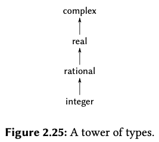

# CS61A - Week 6 Homework

## SICP exercises

**SICP Exercise 2.74** - Insatiable Enterprises, Inc., is a highly de-centralized conglomerate company consisting of a large number of independent divisions located all over the world. The company’s computer facilities have just been interconnected by means of a clever network-interfacing scheme that makes the entire network appear to any user to be a single computer. Insatiable’s president, in her first attempt to exploit the ability of the network to extract administrative information from division files, is dismayed to discover that, although all the division files have been implemented as data structures in Scheme, the particular data structure used varies from division to division. A meeting of division managers is hastily called to search for a strategy to integrate the files that will satisfy headquarters’ needs while preserving the existing autonomy of the divisions.

Show how such a strategy can be implemented with data-directed programming. As an example, suppose that each division’s personnel records consist of a single file, which contains a set of records keyed on employees’ names. The structure of the set varies from division to division. Furthermore, each employee’s record is itself a set (structured differently from division to division) that contains information keyed under identifiers such as address and salary. In particular:

a. Implement for headquarters a `get-record` procedure that retrieves a specified employee’s record from a specified personnel file. The procedure should be applicable to any division’s file. Explain how the individual divisions’ files should be structured. In particular, what type information must be supplied?

> See `insatiable.scm`
>
> ```scheme
> ; Data structures of each department's records
> (define (make-record-marketing name address salary)
>  (list name address salary))
> (define (make-record-finance name address salary)
>  (cons name (cons address salary)))
> (define (make-personnel-file-marketing . records)
>  (type-tag 'marketing-file records)
> (define (make-personnel-file-finance . records)
>  (type-tag 'finance-file (lambda (name)
>    (filter (lambda (record) (eq? (car record) name)) records))))
>
> ; Define map of types and operations
> (put 'marketing-file 'get-record
>     (lambda (name personnel-file)
>       (filter (lambda (record) (eq? (content (car record)) name)) personnel-file)))
> (put 'finance-file 'get-record
>     (lambda (name personnel-file)
>       (personnel-file name)))
>
> ; Generic procedure for getting an employee record
> ; Works for both marketing and finance departments
> (define (get-record employee-name personnel-file)
>  (let ((get-record-proc (get (type-tag personnel-file) 'get-record)))
>    (if get-record-proc
>        (get-record-proc employee-name (contents personnel-file))
>        (error "Unknown operator for type"))))
> ```
>
> Only the `'marketing-file` and `'finance-file` type tags must be supplied. `name`, `address` and `salary` fields exist below the abstraction barrier, so only the constructors and retrievers of the two personnel file types need know about the underlying data structure. `'marketing-file` and `'finance-file` types need to be public so `get-record` can `get` the correct retriever from the type table.

b. Implement for headquarters a `get-salary` procedure that returns the salary information from a given employee’s record from any division’s personnel file. How should the record be structured in order to make this operation work?

> See `insatiable.scm`
>
> ```scheme
> ; Define map of types and operations
> (put 'marketing-file 'get-salary
>     (lambda (name personnel-file)
>       (caddr (get-record name personnel-file))))
> (put 'finance-file 'get-salary
>     (lambda (name personnel-file)
>       (cadr (get-record name-personnel-file))))
>
> ; Generic procedure for getting an employee's salary
> (define (get-salary employee-name personnel-file)
>  (let ((get-salary-proc (get (type-tag personnel-file) 'get-salary)))
>    (if get-salary-proc
>        (get-salary-proc employee-name (contents personnel-file))
>        (error "Unknown operator for type"))))
> ```

c. Implement for headquarters a `find-employee-record` procedure. This should search all the divisions’ files for the record of a given employee and return the record. Assume that this procedure takes as arguments an employee’s name and a list of all the divisions’ files.

> See `insatiable.scm`
>
> ```scheme
> ; Generic procedure for finding an employee from a list of personnel files
> (define (find-employee-record employee-name personnel-files)
>  (let ((record (get-record employee-name (car personnel-files)))
>        (if record
>            record
>            (find-employee-record (cdr personnel-files))))))
> ```

d. When Insatiable takes over a new company, what changes must be made in order to incorporate the new personnel information into the central system?

> You would have to add a new "row" to the type table, such as below:
>
> ```scheme
> (put 'new-company-file 'get-record
>     ; procedure to access new company's ADT here
>     )
> (put 'new-company-file 'get-salary
>     ; procedure to access new company's ADT here
>     )
> ```

**SICP Exercise 2.75** - Implement the constructor `make-from-mag-ang` in message-passing style. This procedure should be analogous to the `make-from-real-imag` procedure given above.

> See `make-from-mag-ang.scm`

```scheme
(define (make-from-mag-ang x y)
  (define (dispatch op)
    (cond ((eq? op 'real-part) (* x (cos y)))
          ((eq? op 'imag-part) (* x (sin y)))
          ((eq? op 'magnitude) x)
          ((eq? op 'angle) y)
          (else (error "Unknown op: MAKE-FROM-MAG-ANG" op))))
  dispatch)
```

**SICP Exercise 2.76** - As a large system with generic operations evolves, new types of data objects or new operations may be needed. For each of the three strategies — generic operations with explicit dispatch, data-directed style, and message-passing-style — describe the changes that must be made to a system in order to add new types or new operations.

- **Generic operations with explicit dispatch**. For each new type, each generic operation that would use that type must be updated with a new conditional clause to handle it. This means **T \* O** changes must be made to the system for each new type, where T is the number of types and O is the number of relevant generic operations. For each new operation, the only change to the system is the creation of the new operation. This means only **O** changes must be made to the system, where O is the number of new operations.
- **Data-directed style**. For each new type, the type-operation table is updated to tell `apply-generic` which procedure to apply to the new type for a given operation. This means **T \* O** changes must be made to the system for each new type, where T is the number of new types and O is the number of relevant generic operations. BUT this is better than explicity dispatch because those changes are made in only one place: change to the system overall is easier because type-operation knowledge is concentrated in the table, not spread over many generic procedures. For each new operation, the type-operation table must be updated for every type that the operation will use: **T \* O** times. Again, this knowledge is concentrated in one place, making change to the system easier to manage.
- **Message-passing style**. For each new type, only the type itself is created: **T** changes. For each new operation, a message is added to the type which contains the required operation: **O** changes. However, message-passing style requires substantial change to the _users_ of the message-passing objects. So unless the system is already written in a message-passing style, each additional type and operation would require exponential modifications to the existing system.

Which organization would be most appropriate for a system in which new types must often be added?

> _Data-directed style_ would be most appropriate, as the changes to the system needed to handle new types would be limited to the type-operation table.

Which would be most appropriate for a system in which new operations must often be added?

> _Explicit dispatch / conventional style_ would be most appropriate for a system in which new operations must often be added, because under conventional style new operations don't require changes elsewhere in the system.

**SICP Exercise 2.77** - Louis Reasoner tries to evaluate the expression `(magnitude z)` where `z` is the object shown in Figure 2.24.


To his surprise, instead of the answer `5` he gets an error message from `apply-generic`, saying there is no method for the operation `magnitude` on the types `(complex)`. He shows this interaction to Alyssa P. Hacker, who says "The problem is that the complex-number selectors were never defined for `complex` numbers, just for `polar` and `rectangular` numbers. All you have to do to make this work is add the following to the complex package:"

```scheme
(put 'real-part '(complex) real-part)
(put 'imag-part '(complex) imag-part)
(put 'magnitude '(complex) magnitude)
(put 'angle '(complex) angle)
```

Describe in detail why this works. As an example, trace through all the procedures called in evaluating the expression `(magnitude z)` where `z` is the object shown in Figure 2.24.

> ```scheme
> (magnitude z)
>    (apply-generic 'magnitude '(z))
>        (map type-tag '(z))
>            '(complex)
>        (get 'magnitude '(complex))
>            magnitude ; Definition of magnitude internal to `install-complex-package`
>        (apply magnitude (map contents '(z)))
>            '(rectangular (3 . 4))
>        (apply magnitude '(rectangular (3 . 4)))
>            (magnitude '(rectangular (3 . 4)))
>            5
>        5
>    5
> 5
> ```
>
> ❌
>
> Correct answer:
>
> Starting with
>
>          `(magnitude '(complex rectangular 3 . 4))`
>
> we call MAGNITUDE giving
>
>          `(apply-generic  'magnitude  '(complex rectangular 3 . 4))`
>
> The apply-generic function (see pg. 184) just uses GET to find the
> entry corresponding to 'magnitude and '(complex), and gets the same
> function MAGNITUDE that we invoked in the first place. This
> time, however, the argument to MAGNITUDE is (CONTENTS OBJ)
> so that the first type flag (COMPLEX) is removed. In other
> words, we end up calling
>
>          `(magnitude '(rectangular 3 . 4))`
>
> Calling the function MAGNITUDE again, this becomes :
>
>       `(apply-generic 'magnitude '(rectangular 3 . 4))`
>
> The apply-generic function now looks up the entry for 'magnitude and
> '(rectangular) and finds the MAGNITUDE function from the RECTANGULAR
> package; that function is called with '(3 . 4) as its argument, which
> yields the final answer... (sqrt (square 3) (square 4)) ==> 5

In particular, how many times is `apply-generic` invoked?

> Twice.

What procedure is dispatched to in each case?

> First, to `magnitude` from the complex package again (but with the type tag stripped). Second, to the `magnitude` function from the rectangular package.

**SICP Exercise 2.79** - Define a generic equality predicate `equ?` that tests the equality of two numbers, and install it in the generic arithmetic package. This operation should work for ordinary numbers, rational numbers, and complex numbers.

> See equ.scm
>
> ```scheme
> (define (equ? x y)
>  (apply-generic 'equ? '(x y)))
>
> ; In install-scheme-number-package
>  (put 'equ? '(scheme-number scheme-number)
>       (lambda (x y) (equal? x y)))
>
> ; In install-rational-package
> (define (equ-rat? x y)
>  (and (equal? (numer x) (numer y))
>       (equal? (denom x) (denom y))))
> ; ...
> (put 'equ? '(rational rational) equ-rat?)
>
> ; In install-complex-package
> (define (equ-com? x y)
>  (and (equal? (real-part x) (real-part y))
>       (equal? (imag-part x) (imag-part y))))
> ; ...
> (put 'equ? '(complex complex) equ-com?)
>
> ```

**SICP Exercise 2.80** - Define a generic predicate `=zero?` that tests if its argument is zero, and install it in the generic arithmetic package. This operation should work for ordinary numbers, rational numbers, and complex numbers.

> See `=zero?.scm`
>
> (define (=zero? n)
> (apply-generic '=zero? n))
>
> ; In install-scheme-number-package
> (put '=zero? 'scheme-number
> (lambda (n) (= n 0)))
>
> ; In install-rational-package
> (define (=zero-rat? n)
> (= n (make-rat 0)))
> ; ...
> (put '=zero? 'rational =zero-rat?)
>
> ; In install-complex-package
> (define (=zero-com? n)
> (= n (make-complex 0)))
> ; ...
> (put '=zero? 'complex =zero-com?)

**SICP Exercise 2.81** - Louis Reasoner has noticed that `apply-generic` may try to coerce the arguments to each other’s type even if they already have the same type. Therefore, he reasons, we need to put procedures in the coercion table to coerce arguments of each type to their own type. For example, in addition to the `scheme-number->complex` coercion shown above, he would do:

```scheme
(define (scheme-number->scheme-number n) n)
(define (complex->complex z) z)
(put-coercion 'scheme-number
              'scheme-number
              scheme-number->scheme-number)
(put-coercion 'complex 'complex complex->complex)
```

a. With Louis’s coercion procedures installed, what happens if apply-generic is called with two arguments of type `scheme-number` or two arguments of type `complex` for an operation that is not found in the table for those types? For example, assume that we’ve defined a generic exponentiation operation:

```scheme
(define (exp x y) (apply-generic 'exp x y))
```

and have put a procedure for exponentiation in the Scheme-number package but not in any other package:

```scheme
;; following added to Scheme-number package
(put 'exp '(scheme-number scheme-number)
    (lambda (x y) (tag (expt x y))))
    ; using primitive expt
```

What happens if we call `exp` with two complex numbers as arguments?

> An infinite loop will occur. Because a coercion now exists for `complex->complex`, the condition `t1->t2` in the final `cond` compound expression will evaluate `true`, resulting in `apply-generic` being called again with effectively the same arguments repeated ad infinitum. The same would occur for `scheme-number->scheme-number`; Louis's coercion procedures have resulted in infinite looping.

b. Is Louis correct that something had to be done about coercion with arguments of the same type, or does `apply-generic` work correctly as is?

> Louis is wrong. Providing the entry in the type-and-operations table contains `'(scheme-number scheme-number)` or `'(complex complex)`, `apply-generic` will work correctly as-is for the relevant type.

c. Modify `apply-generic` so that it doesn’t try coercion if the two arguments have the same type.

> See `apply-generic-without-coercion-of-same-type.scm`:
>
> ```scheme
> (define (homogenous? l)
>  (cond ((null? (cdr l)) #t)
>        ((equal? (car l) (cadr l)) (homogenous? (cdr l)))
>        (else #f)))
>
> (define (apply-generic op . args)
>  (let ((type-tags (map type-tag args)))
>    (let ((proc (if (homogenous? type-tags)
>                    (get op (car type-tags))
>                    (get op type-tags)))
>          (if proc
>              (apply proc (map contents args))
>              (if (= (length args) 2)
>                  (let ((type1 (car type-tags))
>                        (type2 (cadr type-tags))
>                        (a1 (car args))
>                        (a2 (cadr args)))
>                    (let ((t1->t2 (get-coercion type1 type2))
>                          (t2->t1 (get-coercion type2 type1)))
>                      (cond (t1->t2
>                             (apply-generic op (t1->t2 a1) a2))
>                            (t2->t1
>                             (apply-generic op a1 (t2->t1 a2)))
>                            (else (error "No method for these types"
>                                         (list op type-tags))))))
>                  (error "No method for these types"
>                         (list op type-tags)))))))
> ```

**SICP Exercise 2.83** - Suppose you are designing a generic arithmetic system for dealing with the tower of types shown in Figure 2.25: integer, rational, real, complex.



For each type (except complex), design a procedure that raises objects of that type one level in the tower. Show how to install a generic `raise` operation that will work for each type (except complex).

> See `raise.scm`
>
> ```scheme
> ; Constructors
> (define (make-rational-from-integer n) (make-rat n 1))
> (define (make-real-from-rational n) (make-real (numerator n) (denominator n)))
>
> ; Coercion procedures
> (define (integer->rational n) (make-rational-from-integer (contents n)))
> (define (rational->real n) (make-real-from-rational (contents n)))
>
> ; Install to coercion table
> (put-coercion 'integer 'rational integer->ration)
> (put-coercion 'rational 'real rational->real)
>
> ; Install to type-operation table of the rational and integer packages
> (put 'raise '(integer) integer->rational)
> (put 'raise '(rational) rational->complex)
>
> (define (raise n)
>  (apply-generic 'raise n))
> ```

## Lab

**Exercise 1a** - Trace in detail how a simple procedure call such as

```scheme
((lambda (x) (+ x 3)) 5)
```

is handled in `scheme-1`.

```scheme
scheme-1 > ((lambda (x) (+ x 3)) 5)
  (eval-1 ((lambda (x) (+ x 3)) 5))
    ; ... several other predicate conditions evaluate false
    (lambda-exp? ((lambda (x) (+ x 3)) 5)) ; evaluates true, returning the expression
    ((lambda (x) (+ x 3)) 5)
  ((lambda (x) (+ x 3)) 5)
  5
5
```

**Exercise 1b** - Try inventing higher-order procedures; since you don't have define you'll have to use the Y-combinator trick, like this:

```scheme
Scheme-1: ((lambda (f n)        ; this lambda is defining MAP
         ((lambda (map) (map map f n))
          (lambda (map f n)
    (if (null? n)
        '()
        (cons (f (car n)) (map map f (cdr n))) )) ))
         first              ; here are the arguments to MAP
         '(the rain in spain))
(t r i s)
```

**Exercise 1c** - Since all the Scheme primitives are automatically available in scheme-1, you might think you could use STk's primitive map function. Try these examples:

```scheme
Scheme-1: (map first '(the rain in spain))
Scheme-1: (map (lambda (x) (first x)) '(the rain in spain))
```

Explain the results.

`(map first '(the rain in spain))` works as you'd expect it to in Scheme because:

1. `(read)` turns it into a list: `'(map first '(the rain in spain))`, meaning `pair? ...` evaluates `#t` and the `apply-1` procedure is called.
2. The arguments to `apply-1` are further calls to `eval-1`. In the second call to `eval-1` with `(car exp)` as the arguments, `symbol? 'map` evaluates `#t`.
3. `eval-1` then invokes the underlying Scheme's `eval` function, returning the Scheme primitive `map`.
4. `map` is a procedure, so in `apply-1` the predicate `procedure?` evalutes true, calling the underlying Scheme `apply`.
5. `first` is also a symbol in Scheme, so Scheme's underlying `eval` is also used here.
6. Scheme-1 therefore effectively just calls the underlying Scheme `eval` and `apply` functions for the primitives `map` and `first`, resulting in no different behaviour between Scheme and Scheme-1.

`(map (lambda (x) (first x)) '(the rain in spain))` results in the error:

```scheme
; map: contract violation
;   expected: procedure?
;   given: '(lambda (x) (first x))
; [,bt for context]
```

Because:

1. `(read)` turns it into: `'(map (lambda (x) (first x)) '(the rain in spain))`, `pair? ...` == `#t` and `apply-1` is called.
2. `'map` results in the underlying Scheme `map` being used, courtesy of the underlying Scheme `eval`
3. In `apply-1`, `(procedure? map)` evaluates #t.
4. In `eval-1`, `lambda-exp?` evaluates #t for both lambda expressions that are invoked (e.g. `((lambda (x) (first x)) 'argument) ; a`) and those that are not invoked (`(lambda (x) (first x))`). In Scheme-1, lambda expressions pass through unchanged. For the former, the REPL has Scheme's `eval` evaluate the invoked lambda expression, substituting it for its value (`a` in this case). For the latter (a lambda expression not yet invoked), it remains in list form - `'(lambda (x) (first x))`. Scheme's `eval` leaves it as it is, and so in this case when it's passed to `map` the above error results.

> `map`ping `first` over a list in Scheme-1

**Exercise 1d** - Modify the interpreter to add the `and` special form. Test your work. Be sure that as soon as a `false` value is computed, your `and` returns `#f` without evaluating any further arguments.
